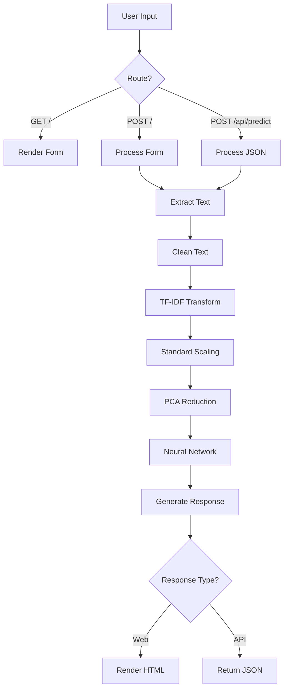

I'll examine the repository files to generate comprehensive app documentation for the text classification web application.# AI Essay Classifier Web Application - Complete Documentation

## 📋 Table of Contents

1. [Project Overview](#project-overview)
2. [Features](#features)
3. [Architecture](#architecture)
4. [Installation & Setup](#installation--setup)
5. [Usage Guide](#usage-guide)
6. [API Documentation](#api-documentation)
7. [Machine Learning Pipeline](#machine-learning-pipeline)
8. [Frontend Documentation](#frontend-documentation)
9. [Development Guide](#development-guide)
10. [Model Training & Improvement](#model-training--improvement)
11. [Troubleshooting](#troubleshooting)
12. [Deployment](#deployment)
13. [Contributing](#contributing)

---

## 📖 Project Overview

The **AI Essay Classifier** is a Flask-based web application that uses machine learning to classify text as either **AI-generated** or **human-written**. Built as an educational project, it demonstrates end-to-end ML workflow implementation with a modern web interface.

### 🎯 Purpose
- **Primary**: Detect AI-generated vs human-written essays and text
- **Educational**: Demonstrate ML pipeline integration in web applications
- **Practical**: Provide both web UI and REST API for text classification

### 🏗️ Tech Stack
| Layer | Technology | Version |
|-------|------------|---------|
| **Backend** | Flask | 3.0.0 |
| **ML Framework** | scikit-learn | ≥1.7.2 |
| **Data Processing** | NumPy | ≥2.0.0 |
| **Model Serialization** | Joblib | ≥1.3.0 |
| **Frontend** | HTML5, CSS3, Vanilla JavaScript | - |
| **UI Framework** | Material Design (custom) | - |
| **Fonts** | Google Fonts (Roboto) | - |

---

## ✨ Features

### 🌟 Core Features
- ✅ **Text Classification**: AI-generated vs Human-written detection
- ✅ **Confidence Scoring**: Percentage confidence in predictions
- ✅ **Probability Breakdown**: Visual bars showing Human% vs AI%
- ✅ **Material Design UI**: Modern, responsive interface
- ✅ **REST API**: JSON endpoint for programmatic access
- ✅ **Real-time Processing**: Instant results on form submission

### 🎨 UI/UX Features
- ✅ **Responsive Design**: Mobile and desktop optimized
- ✅ **Custom Color Palette**: Warm, professional theme
- ✅ **Loading Animations**: Visual feedback during processing
- ✅ **Auto-resize Textarea**: Expands with content
- ✅ **Error Handling**: User-friendly error messages
- ✅ **Accessibility**: ARIA labels and semantic HTML

### 🤖 ML Features
- ✅ **Multi-stage Pipeline**: TF-IDF → Scaling → PCA → Neural Network
- ✅ **Text Preprocessing**: Consistent cleaning and normalization
- ✅ **Feature Engineering**: N-gram extraction and dimensionality reduction
- ✅ **Model Persistence**: Serialized models for fast loading

---

## 🏛️ Architecture

### 📁 Project Structure
```
TextClassificationWebapp/
├── app.py                          # Main Flask application
├── templates/
│   └── index.html                  # Material Design UI
├── TextClassificationWebapp/
│   └── ml_assets/                  # Pre-trained ML models
│       ├── best_nn_model.pkl       # Neural network classifier
│       ├── tfidf_vectorizer.pkl    # TF-IDF feature extractor
│       ├── scaler.pkl              # Standard scaler
│       └── pca.pkl                 # PCA transformer
├── requirements.txt                # Python dependencies
├── README.md                       # User documentation
├── TRAINING_GUIDE.md              # ML training instructions
└── .gitignore                     # Git ignore rules
```

### 🔄 Application Flow


### 🧠 ML Pipeline Architecture
```
Raw Text Input
    ↓
Text Cleaning (lowercase, remove punctuation/numbers)
    ↓
TF-IDF Vectorization (max_features=5000, ngram_range=(1,3))
    ↓
Standard Scaling (normalize features)
    ↓
PCA Dimensionality Reduction (n_components=200)
    ↓
Neural Network Classifier (MLPClassifier: 64→32 neurons)
    ↓
Prediction + Confidence Scores
```

---

## 🚀 Installation & Setup

### Prerequisites
- **Python**: 3.8 or higher
- **pip**: Python package manager
- **Git**: For cloning repository
- **Virtual Environment**: Recommended for isolation

### Step-by-Step Installation

#### 1. Clone Repository
```bash
git clone https://github.com/soipanhamisi/textclassificationwebapp.git
cd textclassificationwebapp
```

#### 2. Create Virtual Environment
```bash
# Create virtual environment
python -m venv venv

# Activate virtual environment
# Windows:
venv\Scripts\activate
# macOS/Linux:
source venv/bin/activate
```

#### 3. Install Dependencies
```bash
pip install -r requirements.txt
```

#### 4. Verify ML Assets
Ensure these files exist in `TextClassificationWebapp/ml_assets/`:
- `best_nn_model.pkl` (Neural network model)
- `tfidf_vectorizer.pkl` (Feature extractor)
- `scaler.pkl` (Data scaler)
- `pca.pkl` (Dimensionality reducer)

#### 5. Run Application
```bash
python app.py
```

The application starts on `http://localhost:5000`

### 🔧 Configuration Options
```python
# In app.py, modify these settings:
app.run(
    debug=True,          # Set False for production
    host='0.0.0.0',      # Change for specific host binding
    port=5000            # Change for different port
)
```

---

## 📖 Usage Guide

### 🌐 Web Interface

#### Accessing the Application
1. Open browser and navigate to `http://localhost:5000`
2. You'll see the main classification interface

#### Using the Classifier
1. **Paste Text**: Enter essay or text content in the textarea
2. **Click "Analyze Text"**: Submit for classification
3. **View Results**: See prediction, confidence, and probability breakdown

#### Understanding Results
- **Classification**: "AI-Generated" or "Human-Written"
- **Confidence**: Overall confidence percentage (0-100%)
- **Probability Bars**: Visual representation of Human% vs AI%

## Link to the deployed webapp.  
https://textclassificationwebapp-production.up.railway.app/